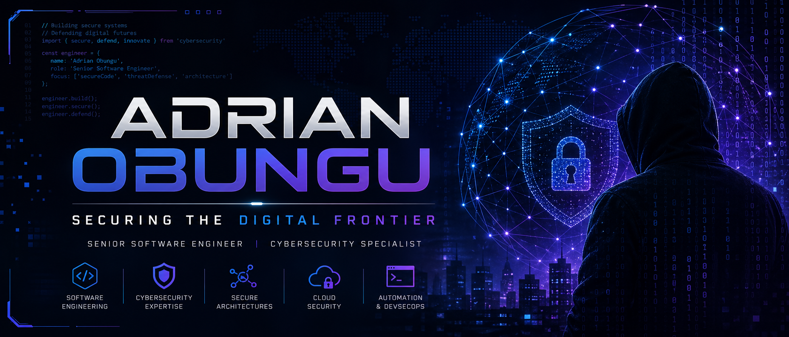

  

<h1 align="center">Hi there, I'm Adrian Obungu 👋</h1>

  <strong>Senior Software Engineer | Cybersecurity Architect | Full-Stack Visionary</strong>

  
  
  

---

### 🧑‍💻 About Me

I am a **Software Engineer** specializing in **Full-Stack Development** and **Cybersecurity Forensics**. My work focuses on building robust, secure, and scalable applications that withstand the complexities of the modern web. I have a deep passion for binary analysis, obfuscation detection, and architectural integrity. Driven by the philosophy of **"building slow, building sure,"** I transform complex security theories into practical, high-end software solutions.

- 🌍 Currently based in **Nairobi, Kenya** (Open to Hybrid/Remote roles).
- 🛡️ Specializing in **Malware Analysis, AI-Driven IDS, and Unified Vulnerability Management**.
- 🚀 Passionate about **minimal environment development** (GitHub Codespaces) and cloud-native forensics.

---

### 🛠️ Technical Arsenal

  
  
  
  
  

  
  
  
  
  

---

### 🚀 Featured Project: PE Binary Obfuscation Detector

A modern, pure-Python heuristic engine designed for high-fidelity classification of Windows Portable Executable (PE) files. 

- **Multi-Vector Scoring**: Correlates Shannon Entropy, IAT Forensics, and EP Signatures.
- **Verdict Explanation Engine**: Generates human-readable forensic narratives.
- **Interactive Reports**: D3.js-powered visual exports for deep-dive analysis.

👉 **[Explore the Repository](https://github.com/Adrian-Obungu/pe-obfuscation-detector)**

---

### 💡 Key Research & Intelligence

| Domain | Highlight | Link |
| :--- | :--- | :--- |
| **Defensive AI** | **Hybrid IDS on iPad**: AI Anomaly Detection using Isolation Forests & Scapy. | [Repo](https://github.com/Adrian-Obungu/pcap-threat-detetcor-) |
| **Offensive Lab** | **MITRE ATT&CK Lab**: Subdomain enumeration and active defense demonstration. | [Lab](https://github.com/Adrian-Obungu/mitre-attack-python-lab) |
| **Strategy** | **Unified Vulnerability Management**: Risk-based prioritization for modern enterprises. | [Article](https://www.linkedin.com/in/adrian-obungu/) |
| **Network** | **OSI Layer Threats**: Comprehensive forensic mapping of cross-layer vulnerabilities. | [Guide](https://www.linkedin.com/in/adrian-obungu/) |

---

### 🎓 Certifications & Expertise

- 🛡️ **Certified Ransomware Protection Officer (CRPO)** | EU Cyber Academy
- 💻 **Level 4 Diploma in Computing** | NCC Education
- 🌐 **Cybersecurity Training** | Cisco Networking Academy
- 🛠️ **Expertise**: Malware Analysis, SDLC, Network Forensics, AI/ML (Scikit-learn), API Chaining.

---

### 💼 Professional Experience

- **Telstra** | Cybersecurity Job Simulation (Threat Analysis & Incident Response)
- **pwc** | Cybersecurity Job Simulation (Risk Assessment & Forensics)
- **Internship on Demand (IOD)** | Winter Accelerator (Professional Development)

---

### 📈 GitHub Stats

  

  

  <em>"Securing the digital frontier one binary at a time."</em>

